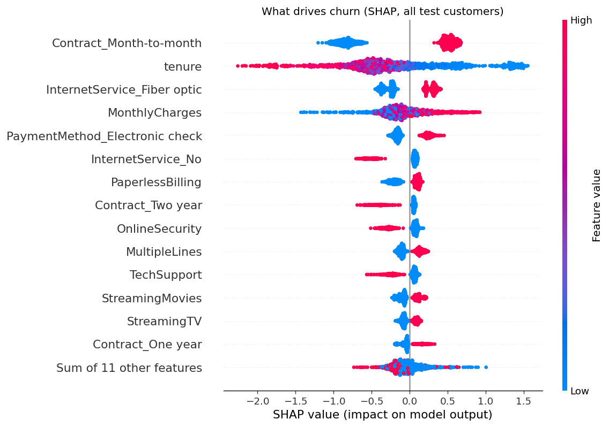
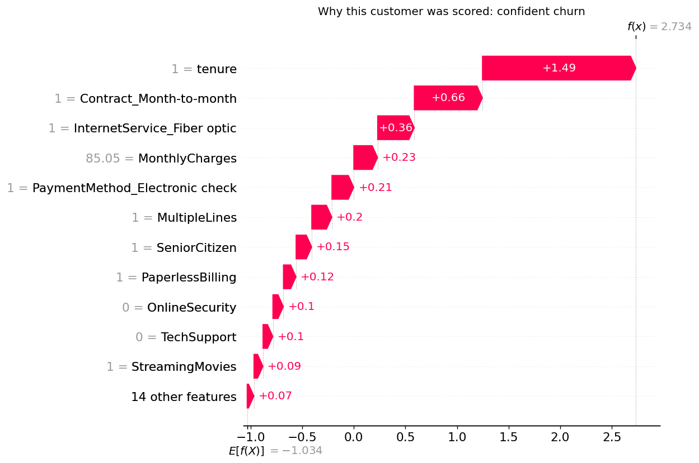
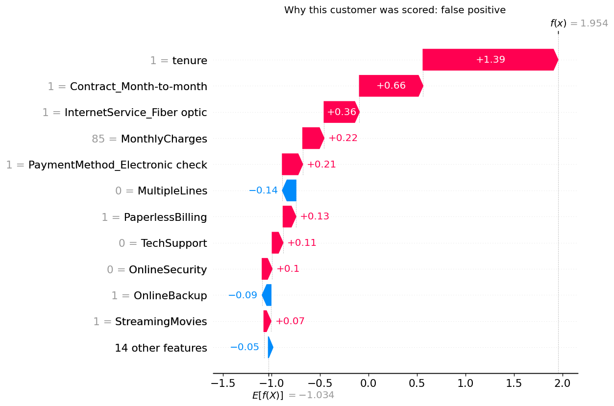

# Telco Customer Churn Prediction

This project builds a classifier that is capable of predicting which telecom customers are about to leave, and explaining why, so a
retention team can act before they go.

This is a full pipeline: raw data in, a ranked list of at-risk customers out,
with each flag backed by a plain-language explanation of what drove it. The
model catches about 90% of customers who go on to churn, and the decision of
who to flag is tied to a real business cost rather than an arbitrary cutoff.


## What the project is for

Keeping an existing customer is far cheaper than winning a new one, so a
company would rather spend a small retention offer now than lose the revenue
later. The catch is you cannot offer everyone a discount. You need to know who
is actually at risk. That is what this model does: it scores every customer by
how likely they are to leave, ranks them, and the retention team works down the
list until the budget runs out.

The dataset is the Telco Customer Churn set from IBM, roughly 7,000 customers
with their contract, tenure, charges, and the services they subscribe to. About
26.5% of them churned, so the classes are imbalanced (far more stay than
leave), which shapes a lot of the decisions below.

## Results

At the chosen decision threshold, on a held-out test set the model never saw
during training:

- Catches 335 of 374 churners (89.6% recall). Only 39 slip through.
- ROC-AUC of 0.85.
- Probabilities are calibrated, so a "0.8 risk" score really does mean roughly
  80% of such customers churn.

Accuracy is 0.69, which is actually lower than you would get by blindly
predicting "nobody churns" (73.5%). That sounds bad until you realise accuracy
is the wrong goal here. Predicting "nobody churns" catches zero leavers and is
useless to a retention team. The whole point is to catch the churners, and for
that recall and business cost matter, not raw accuracy. More on that below.

## Looking at the data first (Data Analysis)

Every decision in the pipeline traces back to something found in the EDA
(`notebooks/eda.ipynb`). A few findings did most of the work.

**Contract type is the strongest signal.** Month-to-month customers churn at
42.7%, one-year at 11.3%, two-year at just 2.8%. The reason is simple, a
month-to-month customer can walk away at the end of any month with no penalty,
so the decision to stay is live every single month. A two-year customer made
that decision once and is locked in.

**Churn happens early.** New customers are the highest risk, and the risk drops
steadily the longer someone has been around. The retention battleground is the
first few months.

**Higher charges go with churn**, though this one is tangled up with the
others. Expensive customers tend to be on fibre and month-to-month, so some of
the "high charges churn more" effect is really the contract and service effect
in disguise. 

**One data quality trap.** TotalCharges looked numeric but was stored as text,
because 11 rows held a blank instead of a number. All 11 were brand-new
customers with a tenure of 0, they simply had not been billed yet. So the blank
is not missing data, it means "nothing billed so far," and the right fill is 0,
not an imputed average. Imputing an average would have invented over a thousand
pounds of billing for customers who had paid nothing.

### A couple of features that did not make the cut (Feature Selection/Engineering)

Two engineered features were tested and rejected, which is worth mentioning
because knowing what to leave out is part of the job.

TotalCharges is almost exactly tenure multiplied by monthly charges. I checked
whether the leftover part (the bit not explained by that product) carried any
signal, in case bills changing over time mattered. It did not, the residual
correlated 0.00 with churn. So TotalCharges was dropped as redundant, which also
tidied up the model.

A "number of services" count looked promising (the idea being that customers
with more services are more locked in), but on inspection its relationship with
churn was just contract type and monthly charges wearing a different hat. It
carried no signal of its own and would have stolen credit from Contract in the
explanations, so it was left out.

## The decisions that shaped the model

**Handling the imbalance.** With a 26.5% churn rate, a naive model can score
well on accuracy by mostly predicting "stay." The common fixes are to reweight
the classes or generate synthetic minority examples. I tested reweighting and
found it did not improve how well the model ranked customers by risk, and it
made the probabilities noticeably worse (less honest). Since the goal is a
trustworthy ranked list, the better approach was to leave the training alone and
instead choose the decision threshold carefully. The comparison is in the
training output.

**Choosing the threshold from business cost.** A model outputs a probability;
you still have to pick the cutoff where "flag this customer" kicks in. The
default of 0.5 assumes both mistakes cost the same, which they do not. Missing a
churner (they leave, you lose their revenue) is far more costly than a false
alarm (you waste a small retention offer on someone who would have stayed).

I put a number on this from the data. Churners pay about £74/month on average,
and a retention discount costs maybe £10/month, so missing a churner is roughly
seven times as costly as a wasted offer. Feeding that 7:1 ratio into a threshold
sweep pushed the cutoff down to 0.15, well below the default. That is the model
correctly deciding to flag aggressively, accepting more false alarms to avoid
expensive misses. The threshold chart shows the cost of every possible cutoff,
with a clear dip where the chosen one sits.

**The model lineup.** I compared logistic regression, random forest, XGBoost,
and TabPFN (a tabular foundation model). The interesting result is that they all
finished within one standard deviation of each other on cross-validated PR-AUC,
a statistical tie. TabPFN edged it numerically, but XGBoost and even plain
logistic regression were right behind. That is itself a finding: the signal in
this data is mostly accessible to simple models, and the fancy one does not buy
much.

Because the models tied, "best score" was not a useful tiebreaker, so I chose on
other grounds. The explanations below are built on XGBoost, because it is
statistically as good as the others while being cleanly explainable. Nothing was
lost in performance and the whole interpretability story was gained.

## Explaining the predictions with SHAP

A ranked list is more useful when each flag comes with a reason. SHAP breaks
every prediction down into how much each feature pushed it toward or away from
churn.



The global picture confirms the EDA almost exactly. Contract (month-to-month)
and tenure are the two most dominant drivers, well ahead of everything else. Then
comes the cluster the EDA flagged: fibre internet, monthly charges, and paying
by electronic check, all pushing toward churn and all travelling together. The
model learned the same patterns the EDA found by hand, in the same order
of importance, which is exactly what makes its flags trustworthy.

The per-customer view is where it becomes actionable. Here is a customer the
model was confident would churn:



Every factor stacks the same way: new customer, month-to-month, on fibre, paying
by electronic check, no support services. Each is a moderate push, and together
they add up to a high-confidence flag. No single feature is a smoking gun; the churn
is a pile-up of risk factors.

The most instructive case is a false positive, a customer the model flagged who
actually stayed:



This customer looked exactly like a churner: one month in, month-to-month,
fibre, electronic check. The model was not wrong to flag them, they genuinely
had the profile of a leaver, they just happened to stay. This is the honest
nature of a false positive, and it is why the aggressive threshold is
justified. At a 7:1 cost ratio, occasionally offering a discount to a
convincing lookalike is a price worth paying to catch the real churners who
share that profile.

## Trying it on fresh customers

To check the finished pipeline end to end, `generate_test_data.py` makes a batch
of synthetic customers (raw, unlabelled, the same messy shape as the original
file) and `predict.py` scores them into a ranked worklist. This is a plumbing
test, not a performance test: the customers are made up, so it proves the
pipeline handles raw input correctly and produces sensible rankings, not that
the model is accurate (the held-out test set already covers that).

Seeded into the batch were three hand-built edge cases, and they landed exactly
where their profiles say they should:

- A brand-new customer on a month-to-month fibre plan came out as the single
  highest risk in the whole batch (0.89), right at the top of the worklist.
- A long-tenured customer on a two-year contract with every service came out
  near the very bottom (0.06).
- A no-internet customer on a one-year contract also scored low (0.07).

So a customer built to look like a churner rose to the top, and customers built
to look loyal sank to the bottom, on data the model had never seen. The output
is sorted highest-risk-first, so a retention team with budget for the top 20
customers just works down from the top; the flag is the cutoff, but the ranking
is what you actually act on.

## Final remarks

The model does what it set out to do: it produces a ranked, business-costed,
explainable list of at-risk customers. A retention team could take the top of
that list, read why each person was flagged, and tailor the offer accordingly.

A few honest limits are worth stating. 

The model is trained on one company's snapshot, so the specific patterns are theirs, so a different telecom might behave
differently, and testing that would need a genuinely different dataset with real outcomes (a good candidate for a follow-up). The cost ratio, while grounded in
the data, still rests on an assumed discount depth, so the threshold should be revisited with real retention figures.

What the project demonstrates end to end: careful data cleaning driven by
understanding rather than reflex, feature decisions tested rather than assumed,
an imbalance strategy chosen on evidence, a threshold tied to real cost, and
predictions that can be explained one customer at a time.

## Project structure

```
telco-churn-analysis/
├── notebooks/
│   └── eda.ipynb              exploratory analysis, every decision starts here
├── data/
│   ├── raw/                   the Telco dataset (committed)
│   ├── processed/             cleaned and encoded data (generated, gitignored)
│   └── test/                  synthetic customers for prediction (generated, gitignored)
├── models/                    saved model bundle (generated, gitignored)
├── analysis/                  charts (committed, the README renders them)
├── data_cleaning.py           fixes the TotalCharges trap, collapses categories, encodes target
├── feature_selection.py       encoding and redundancy handling
├── model_training.py          trains, compares, calibrates, sets threshold, saves best model
├── explain_model.py           SHAP explanations
├── generate_test_data.py      synthetic customers to exercise the predictor
├── predict.py                 scores new customers into a ranked worklist
├── run.py                     orchestrates the stages with toggles
├── .gitignore
└── README.md
```

## Running it

The pipeline runs in stages through `run.py`, with toggles at the top for the
optional parts (SHAP, synthetic data generation, batch prediction).

```
python run.py
```

Each stage can also be run on its own. The stages, in order:

- `data_cleaning.py` fixes the TotalCharges trap, collapses redundant
  categories, encodes the target.
- `feature_selection.py` handles encoding and drops the redundant column.
- `model_training.py` trains and compares the models, calibrates, chooses the
  threshold, and saves the best model.
- `explain_model.py` produces the SHAP charts.
- `generate_test_data.py` makes synthetic customers to exercise the predictor.
- `predict.py` scores a batch of new customers into a ranked worklist.

Generated files (models, processed data) are not committed; they rebuild from a
fresh run. The charts in `analysis/` are committed so this README renders them.
